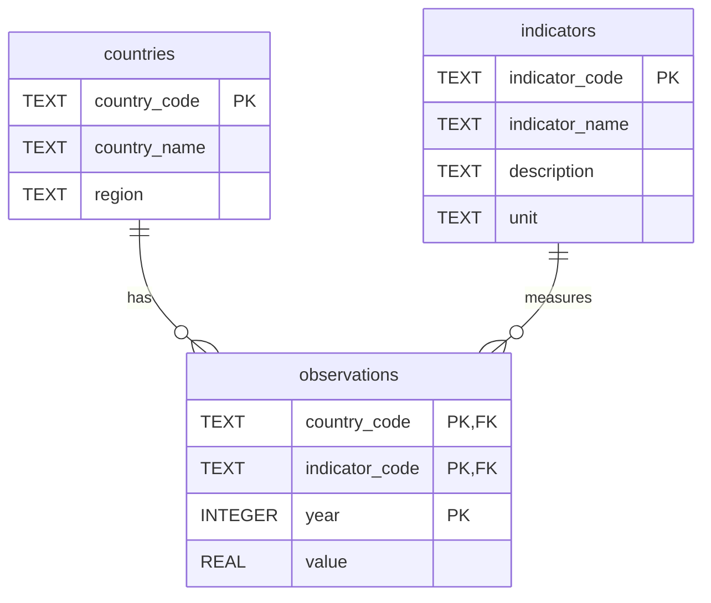

# From Pandemic to Inflation: Europe’s Uneven Economic Recovery, 2019–2024

## Project overview

This project analyses how the 27 European Union countries recovered from the COVID-19 pandemic and the subsequent inflation shock between **2019 and 2024**.

The project combines **exploratory data analysis (EDA), SQL, Python, statistical testing, and data visualisation**. The objective is not only to describe how EU economies changed over time, but also to test whether inflation was systematically associated with subsequent GDP growth or unemployment outcomes.

The analysis uses three macroeconomic indicators from the **World Bank World Development Indicators (WDI)**:

- **Real GDP growth (annual %)** — `NY.GDP.MKTP.KD.ZG`
- **Inflation, consumer prices (annual %)** — `FP.CPI.TOTL.ZG`
- **Unemployment, total (% of total labour force, ILO modelled estimate)** — `SL.UEM.TOTL.ZS`

The final analytical dataset contains:

- **27 EU countries**
- **6 years (2019–2024)**
- **3 indicators**
- **486 country-indicator-year observations**

---

## Research questions and hypotheses

### RQ1 — GDP recovery

**Question:** Which EU countries recovered their pre-pandemic real GDP level by 2024?

**Hypothesis:** Most EU countries recovered their pre-pandemic GDP levels by 2024, although the timing and extent of recovery differed.

To answer this question, annual real GDP growth rates were transformed into a cumulative GDP index with **2019 = 100**.

---

### RQ2 — Inflation and subsequent GDP growth

**Question:** Was higher inflation in 2022 associated with weaker real GDP growth in 2023?

**Hypothesis:** Countries experiencing higher inflation in 2022 subsequently recorded weaker GDP growth in 2023.

The relationship was evaluated using:

- a country-level SQL comparison,
- Pearson correlation,
- Spearman rank correlation,
- and a scatter plot.

---

### RQ3 — Disinflation and unemployment

**Question:** Was the reduction in inflation between 2022 and 2024 associated with rising unemployment?

**Hypothesis:** Countries experiencing larger reductions in inflation also experienced greater increases in unemployment.

For each country, the analysis calculated:

- change in inflation between 2022 and 2024, and
- change in unemployment between 2022 and 2024.

Pearson and Spearman correlations were then used to test whether larger inflation reductions were systematically associated with larger unemployment increases.

---

### RQ4 — Economic convergence or divergence

**Question:** Did EU economies become more similar or more divergent between 2019 and 2024?

**Hypothesis:** GDP-growth and inflation dispersion increased during the respective economic shocks before declining by 2024, while unemployment followed a different trajectory.

Cross-country dispersion was measured annually using:

- range,
- sample variance,
- and standard deviation.

This question concerns the dispersion of **growth, inflation and unemployment rates**, not convergence in GDP levels or living standards.

---

## Data source

The data comes from the **World Bank World Development Indicators**.

Source: <https://databank.worldbank.org/source/world-development-indicators>

The World Bank download contained:

- the main indicator observations,
- country metadata,
- indicator metadata.

The raw World Bank dataset was reshaped and filtered to retain only:

- the 27 current EU member states,
- the years 2019–2024,
- the three indicators used in the analysis.

Missing economic observations were kept as missing values rather than being artificially imputed.

---

## Data cleaning and preparation

The original World Bank data was supplied in a wide format, with individual years stored as separate columns.

The main preparation steps were:

1. Select the 27 EU countries.
2. Select the three relevant World Bank indicators.
3. Restrict the time period to 2019–2024.
4. Reshape the dataset from wide to long format.
5. Standardise column names and data types.
6. Check for duplicate records.
7. Check missing values and blank values.
8. Separate descriptive country and indicator information from the observation table.
9. Load the cleaned data into SQLite.

The cleaned observations table has one row for each unique:

`country × indicator × year`

---

## Database design

The SQLite database contains three normalised tables:

- `countries`
- `indicators`
- `observations`

### Entity relationship diagram



### Why this structure?

Country and indicator metadata are stored only once instead of being repeated for every yearly observation.

The `observations` table uses a **composite primary key**:

`country_code + indicator_code + year`

This guarantees that each country-indicator-year combination is unique.

The foreign keys connect each observation to its corresponding country and indicator.

---

## SQL analysis

The SQL analysis is stored in:

`sql/queries.sql`

The project contains six main analytical queries.

### Query 1 — Real GDP index

Builds a cumulative real GDP index with:

`2019 = 100`

Annual GDP growth rates are compounded to estimate the path of real GDP relative to the 2019 baseline.

---

### Query 2 — Recovery classification

Identifies:

- whether a country contracted in 2020,
- the first year in which it recovered its 2019 GDP level,
- whether it remained at or above that level by 2024.

---

### Query 3 — Inflation in 2022 vs GDP growth in 2023

Joins the observations table to itself in order to place:

- 2022 inflation, and
- 2023 real GDP growth

on the same row for each country.

This produces the dataset used for the RQ2 correlation analysis.

---

### Query 4 — Above- vs below-average inflation

Divides countries into two groups based on 2022 inflation:

- above the EU-country average,
- at or below the EU-country average.

It then compares average 2023 GDP growth between the groups.

---

### Query 5 — Inflation and unemployment changes

Calculates, for every country:

- inflation change from 2022 to 2024,
- unemployment change from 2022 to 2024.

This query provides the dataset for RQ3.

---

### Query 6 — Cross-country dispersion

Calculates annual dispersion for all three indicators using:

- country count,
- mean,
- range,
- sample variance.

Standard deviation is subsequently obtained in Python as the square root of the SQL variance.

---

## Key findings

### RQ1 — Most countries recovered, but recovery was uneven

Of the 27 EU countries:

- **25 experienced a real GDP contraction in 2020**
- **Ireland and Lithuania did not contract in 2020**
- **17** of the contracting countries first recovered their 2019 GDP level in **2021**
- **8** first recovered in **2022**
- by 2024, **24 of the 25** countries that had contracted were at or above their 2019 GDP level

Finland was the only country in the contracting group below the 2019 baseline in 2024, with an index of approximately **99.95**.

Recovery trajectories nevertheless differed substantially. For example:

- Malta: approximately **131.92**
- Croatia: approximately **119.37**
- Germany: approximately **100.04**

**Conclusion:** RQ1's hypothesis was supported.

---

### RQ2 — Higher inflation did not significantly predict weaker growth

Correlation between **2022 inflation** and **2023 GDP growth**:

| Test | Correlation | p-value |
|---|---:|---:|
| Pearson | -0.289 | 0.1438 |
| Spearman | -0.112 | 0.5790 |

The Pearson coefficient indicates a weak negative relationship, but neither test is statistically significant at the 5% level.

The SQL group comparison showed:

- countries with above-average inflation: average 2023 GDP growth ≈ **0.63%**
- countries with at-or-below-average inflation: average 2023 GDP growth ≈ **1.33%**

However, this difference was sensitive to Malta's unusually high 2023 GDP growth.

**Conclusion:** RQ2's hypothesis was **not statistically supported**.

---

### RQ3 — Disinflation did not consistently coincide with rising unemployment

Inflation declined in all 27 EU countries between 2022 and 2024.

Over the same period:

- unemployment increased in **16** countries,
- decreased in **10** countries,
- remained unchanged in **1** country.

Correlation between the change in inflation and the change in unemployment:

| Test | Correlation | p-value |
|---|---:|---:|
| Pearson | -0.207 | 0.3011 |
| Spearman | 0.091 | 0.6507 |

Neither relationship is statistically significant.

**Conclusion:** RQ3's hypothesis was **not statistically supported**.

---

### RQ4 — Shocks temporarily increased dispersion in GDP growth and inflation

Cross-country sample variance:

| Indicator | 2019 | Peak | 2024 |
|---|---:|---:|---:|
| GDP growth | 1.99 | 12.63 (2020) | 2.61 |
| Inflation | 1.00 | 16.93 (2022) | 1.07 |
| Unemployment | 10.67 | 10.67 (2019) | 4.70 |

The results show three different patterns:

- **GDP-growth dispersion** increased sharply during the 2020 pandemic shock before declining.
- **Inflation dispersion** peaked during the 2022 inflation shock and was close to its 2019 level again by 2024.
- **Unemployment dispersion** declined steadily throughout the period.

**Conclusion:** RQ4's descriptive hypothesis was supported.

This finding should not be interpreted as evidence that EU countries converged in GDP levels, income, productivity or living standards.

---

## Overall conclusion

Most EU economies recovered their pre-pandemic GDP levels, but they did not follow a common recovery path.

The strongest findings are descriptive:

- the pandemic produced a sharp temporary divergence in GDP-growth rates,
- the inflation shock produced a sharp temporary divergence in inflation rates,
- and unemployment-rate dispersion declined over the period.

The two correlation-based hypotheses received limited statistical support.

Higher inflation in 2022 was weakly associated with lower GDP growth in 2023, but the relationship was not statistically significant.

Likewise, countries with larger reductions in inflation between 2022 and 2024 did not systematically experience larger increases in unemployment.

The analysis therefore suggests that differences in post-pandemic economic outcomes cannot be explained by inflation alone.

---

## Visualisations

The project uses four main visualisations:

1. **GDP recovery trajectories** — indexed real GDP, 2019 = 100.
2. **Inflation vs GDP growth** — scatter plot for RQ2.
3. **Inflation change vs unemployment change** — scatter plot for RQ3.
4. **Cross-country dispersion** — annual standard deviation for GDP growth, inflation and unemployment.

The charts are generated in the hypothesis and visualisation notebook and are used in the final presentation.

---

## Limitations

Several limitations should be considered when interpreting the results.

### Small sample for the correlation tests

RQ2 and RQ3 use one observation per EU country, resulting in only 27 observations.

This limits statistical power and makes the results sensitive to individual countries.

### Correlation is not causation

The analysis identifies associations but does not establish causal effects.

GDP growth and unemployment may also be influenced by factors such as:

- monetary policy,
- fiscal policy,
- energy prices,
- industrial structure,
- trade exposure,
- labour-market institutions.

### Countries are equally weighted

Each country counts as one observation regardless of its population or economic size.

The findings therefore describe differences across **countries**, rather than the behaviour of the EU economy as one aggregated economy.

### Country-specific measurement issues

Some national indicators may be affected by unusual economic structures.

For example, GDP data for highly internationally integrated economies such as Ireland can be strongly affected by multinational activity.

### Short time period

The analysis covers 2019–2024.

This captures the pandemic and inflation shock well, but provides only a limited pre-pandemic baseline.

---

## Next steps

With additional time, the project could be extended by:

1. adding more pre-2019 years,
2. including GDP per capita,
3. incorporating interest rates and fiscal variables,
4. adding energy-price or energy-dependence measures,
5. comparing euro-area and non-euro-area countries,
6. testing the influence of outliers,
7. using multivariate regression,
8. developing a panel-data model with country and time effects.

These additions could help distinguish simple cross-country correlations from broader macroeconomic mechanisms.

---

## Repository structure

```text
project-1-eda-sql/
│
├── data/
│   └── project.db
│
├── notebooks/
│   ├── 01_eda.ipynb
│   └── 03_hypothesis_and_visualization.ipynb
│
├── sql/
│   ├── schema.sql
│   └── queries.sql
│
├── images/
│   └── visualisations used in the analysis/presentation
│
└── README.md
```

### Main files

| File | Purpose |
|---|---|
| `notebooks/01_eda.ipynb` | Data inspection, cleaning, transformation and database preparation |
| `notebooks/03_hypothesis_and_visualization.ipynb` | SQL results, statistical analysis, visualisations, conclusions and limitations |
| `sql/schema.sql` | SQLite database schema |
| `sql/queries.sql` | Six analytical SQL queries |
| `data/project.db` | SQLite database used for the analysis |
| `README.md` | Complete project documentation |

---

## How to run the project

### 1. Clone the repository

```bash
git clone <repository-url>
cd project-1-eda-sql
```

### 2. Install the required Python packages

```bash
pip install pandas numpy scipy matplotlib seaborn jupyter
```

SQLite support is included with Python through the `sqlite3` standard library.

### 3. Start Jupyter

```bash
jupyter notebook
```

### 4. Run the notebooks in order

First:

```text
notebooks/01_eda.ipynb
```

Then:

```text
notebooks/03_hypothesis_and_visualization.ipynb
```

If the Jupyter kernel is restarted, rerun the setup cells so that the SQLite connection and required DataFrames are recreated.

---

## Technologies used

- **Python**
- **pandas**
- **NumPy**
- **SciPy**
- **Matplotlib**
- **Seaborn**
- **SQLite**
- **SQL**
- **Jupyter Notebook**
- **DB Browser for SQLite**
- **Git / GitHub**

---

## Author
Jonathan Weininger
Ironhack Data Science & Machine Learning — Project 1:  
EDA + SQL
